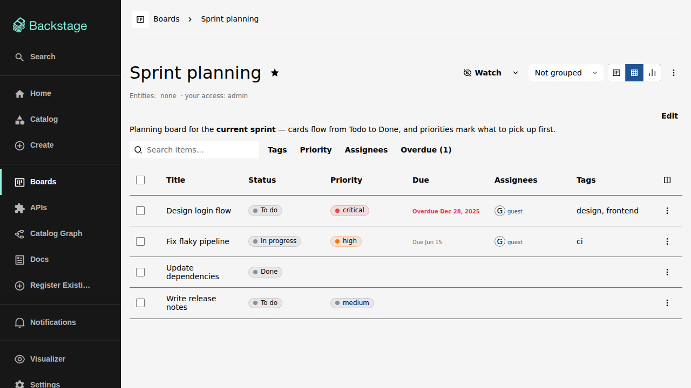
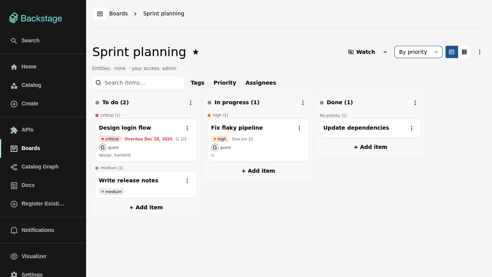
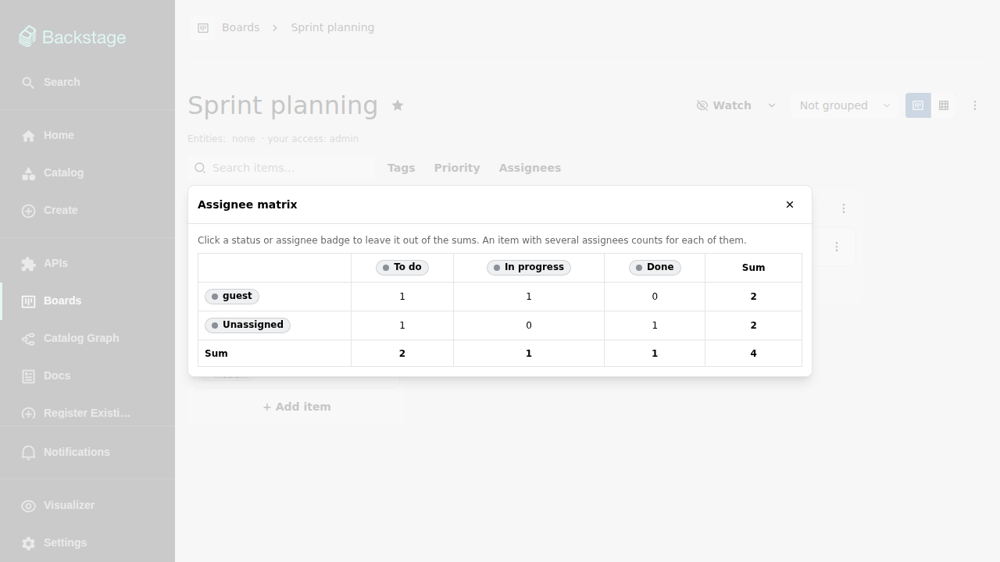

# Board views

A board shows its items either as a kanban board or as a table. The two
view-switch buttons next to the board menu toggle between them; both views
show the same items and respect the same filters.

## Kanban view

Each column is one status, with its item count in the header and a colored
dot when the column has a color. Cards show the item's title and — when set —
its priority, due date (colored by urgency), checklist progress, assignee
avatars, and tags. **+ Add item** at the bottom of each column creates an
item directly in that column.

Drag a card to move it between columns or to reorder it; an insertion line
shows exactly where it will land — between two cards, after the last card
of a column, or in an empty column — and the drop places it right there,
also inside grouped lanes. The same moves are available without a pointer:
`Ctrl+←`/`Ctrl+→` on a focused card, or the item menu's **Move to column**
entry. Moves and edits apply optimistically — the UI updates immediately
and rolls back if the server rejects the change.

## Table view

The table shows one row per item with its status, priority, due date,
assignees, and tags. Click a column header to sort. The column-picker button
above the table chooses which columns are shown; the leading selection
column and the trailing actions column always stay put.

Selecting rows with the checkboxes enables bulk actions: change the status,
assignee, priority, due date, or tags of every selected item at once (see
[Working with items](items.md)). The selection is shared with the kanban
view — selected cards show a marked outline there, and switching views
keeps the selection.

## Keyboard navigation

Both views are fully keyboard-operable. On the kanban view, tab to a card
and use the arrow keys: `↑`/`↓` walk the cards of a column, `←`/`→` jump
to the neighbouring column, and a visible focus ring follows along. In the
table view, `↑`/`↓` move the row focus, continuing across group boundaries
when the table is grouped; `←`/`→` do not navigate between items there.

While an item (card or row) is focused:

| Key                 | Action                                            |
| ------------------- | ------------------------------------------------- |
| `Ctrl+←` / `Ctrl+→` | Move the item one column left / right             |
| `Space`             | Select or deselect the item for bulk actions      |
| `Enter`             | Open the item's actions menu                      |
| `s`, `c`, or `m`    | Open the move-to-column (status) picker           |
| `a`                 | Open the assignee picker                          |
| `d`                 | Open the due-date picker                          |
| `p`                 | Open the priority picker (boards with priorities) |
| `1`–`9`, `0`        | Set the priority with that order (`0` = 10)       |
| `Delete`            | Archive the item                                  |

The shortcuts only fire on the focused item itself — typing in an inline
editor or an open menu is never hijacked — and they stay inert on
externally managed items and for read-only visitors.

## WIP limits

Each column can carry an optional **soft** and **hard** WIP limit
(column menu → **WIP limits**). Once the column's item count — counted
over all items, regardless of filters — reaches the soft limit, the
column header takes a warning background and shows the count against the
limit (for example `Doing (3/5)`). At the hard limit the header turns
red and the column stops accepting items: its add-item row and the
move/status entries into it disable, drops from other columns are
ignored, and the backend rejects create or move requests into the full
column. Reordering inside the column and moving items out stay possible.

## Filter bar

Both views share the filter bar: free-text search over titles and
descriptions, a **Tags** filter, an **Assignees** filter, and — when the
board defines priorities — a **Priority** filter. Once any listed item
is overdue, an **Overdue (n)** toggle appears with the live count and
narrows the board to items due before today. An item must match the
text, carry **all** selected tags, and be assigned to **any** selected
assignee. Active filters are reflected in the item counts, and one click
clears them all.

## Grouping

The grouping dropdown in the board header regroups both views:

- **Not grouped** — plain columns and rows.
- **By assignee** — items grouped per assignee; an item with several
  assignees appears in each of their groups, items without one under
  "Unassigned".
- **By priority** — items grouped by priority, highest first:

Grouping only changes the visual arrangement — drag & drop and all other
actions keep working.

## The assignee matrix

The board menu offers an **Assignee matrix**: every column (status) as one
axis and every assignee as the other, each cell counting the matching items,
with sum rows and columns. An item with several assignees counts for each of
them, and items without an assignee show in a trailing **Unassigned** row.

The status and assignee badges are clickable: unselecting one leaves it out
of the sums (its own cells stay visible), and clicking again brings it back.
The matrix respects the currently active filters. Boards that define
priorities offer a second, analogous matrix — see
[Priorities](priorities.md).

## Board header

The header also carries the favorite star, the referenced entities and your
access level, the [watch control](watching-and-notifications.md), and the
board menu with board-level actions: settings, sharing, duplicating,
archiving, the matrices, [recent changes](comments-and-history.md), and the
[archived items](items.md) of the board.

## Board description

Right under the header a board can carry a markdown description — what
the board is for, how the columns are used. Anyone with write access
edits it in place (the same markdown block items use); saving an empty
text clears it. Every edit is retained, and once the description has
been edited more than once a **History** button shows the previous
versions with author and timestamp. Duplicating the board copies the
current text.
