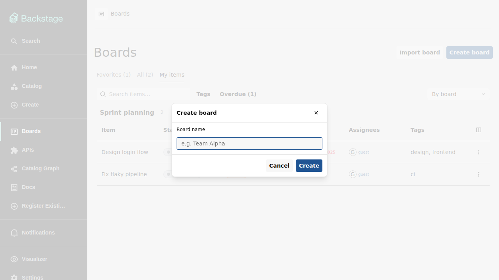
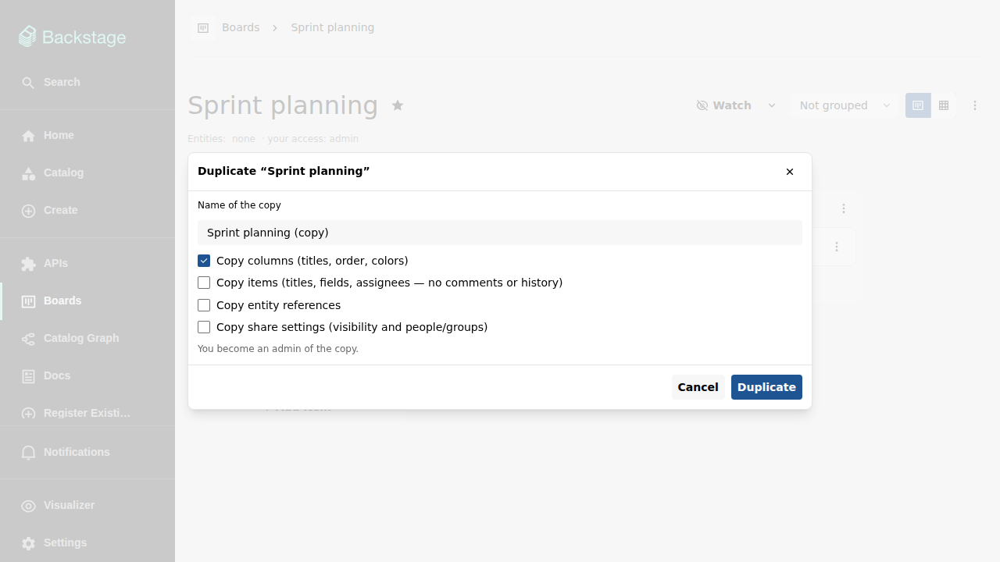
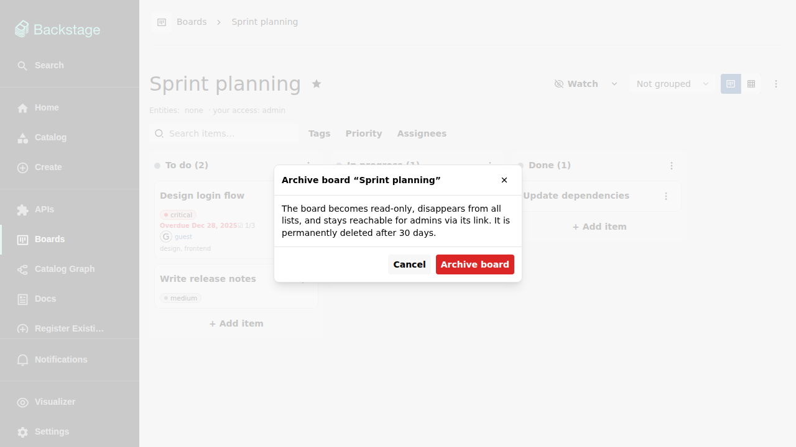

# The boards list

Open **Boards** in the sidebar (or go to `/boards`) to see every board you
can access. The page has three tabs:

- **Favorites** — the boards you have marked as favorite.
- **All** — every board you can access, via a direct grant, a group grant,
  or a public visibility mode.
- **My items** — everything assigned to you, across boards (see
  [My items](my-items.md)).

The tab labels count all matching boards, independent of any filters. Each
row shows the board's name, the catalog entities it references, your access
level, and a per-status item count, and both tabs paginate: a footer below
the table shows the visible range, the total, previous/next controls, and a
page-size choice.

## Filtering the list

The filter bar narrows the list by free-text search, referenced catalog
entity, and creator. The options offered in the entity and creator filters
are scoped to your own boards, so they never leak boards you cannot see.

## Favorites

Favorites are per-user: starring a board affects only your own Favorites tab
(and your [Boards home page card](home-page.md)). Toggle the star from the
board list's row menu or from the star next to the board title on the board
page itself.

## Row and context menus

Every row ends in an actions menu; the same menu also opens directly at the
pointer when you right-click the row. It offers opening the board and
toggling its favorite state. Clicking anywhere else on the row opens the
board.

## Creating a board

**Create board** opens a dialog asking only for a name — everything else
(columns, priorities, sharing, entities) is configured on the board
afterwards. New boards start private, with you as their admin, and with a
default set of columns and priorities.

## Duplicating a board

The board menu's **Duplicate** creates a copy that belongs to you. You
choose what to copy:

- **Columns** — titles, order, and colors (checked by default).
- **Items** — titles, fields, assignees, tags, and checklists; comments and
  history are never copied.
- **Entity references** — the catalog entities the board is assigned to.
- **Share settings** — visibility mode and people/group grants.

Whatever you copy, you become an admin of the copy.

## Archiving a board

Deleting a board archives it rather than removing it immediately:

An archived board disappears from all listings and stays reachable read-only
via its direct link. Its page shows an alert stating when it will be
permanently deleted and offers admins two actions: **Unarchive**, which
restores the board completely, and **Delete now**, which removes it
immediately. A scheduled backend task permanently deletes boards archived
more than 30 days ago, including all their data.

Renaming and deleting require `admin` access on the board — see
[Sharing a board](sharing.md).
