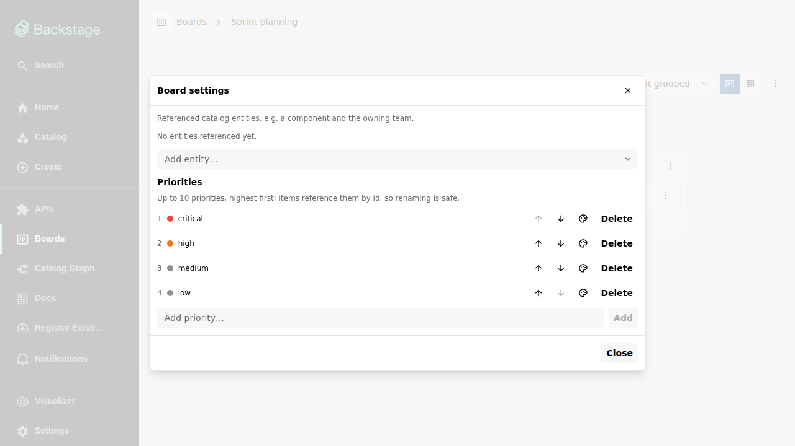

# Catalog integration

Boards are part of the portal, not an island next to it: a board can
reference the catalog entities it is about, and those entities grow a
**Boards** tab.

## Referencing entities

Users with `admin` access assign entities in the board settings — for
example the component the work is about and the team that owns it. A board
can reference any number of entities:

The referenced entities are shown under the board title, and the boards list
can be filtered by them.

## The entity "Boards" tab

Entities that at least one non-archived board references get a **Boards**
tab on their catalog page, listing those boards. The tab appears only where
it has something to show: the catalog module
(`@internal/plugin-catalog-backend-module-boards`) derives a
`boards/is-referenced: "auto-detected"` label for referenced entities, and
the tab is filtered on that label.

The label is always derived, never taken from the entity's own
`catalog-info.yaml` — declaring it by hand has no effect. When a board's
entity assignments change (or a board is archived, unarchived, duplicated
with entities, or deleted), the affected entities are refreshed within
seconds rather than at the next full catalog sweep.

One caveat is deliberate: the label says "a board references this entity",
not "you may read that board". The tab can therefore be empty for a viewer
without access to the referencing board, and its empty state says exactly
that: "No boards are assigned to this entity that you can access."

Admins can replace the tab's filter to show it on more entities — see
[Configuration](../configuration.md).

## Display names everywhere

The integration also works in the other direction: wherever boards show a
creator or assignee, the catalog entity's display name is used
(`spec.profile.displayName` for users and groups, `metadata.title`
otherwise), with the raw entity ref as a tooltip. Entity refs in comments
auto-link to the entity's catalog page.
