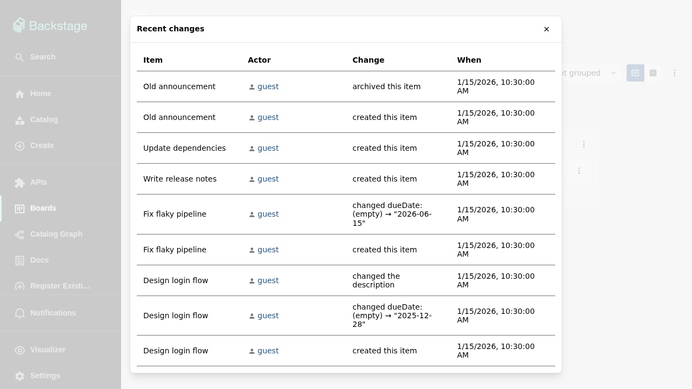

# Comments and history

Every item carries a full record of what happened to it: comments from
people, and an audit log of every other change. Both live in the activity
block of the [item details drawer](item-details.md).

## Comments

Anyone with write access can comment. Comments support a markdown subset,
and two kinds of references are linked automatically:

- **Catalog entity refs** — writing a ref like `system:default/example`
  turns it into a link to that entity's catalog page.
- **Mentions** — `@`-mentioning a user renders as a link to their catalog
  page and [notifies them](watching-and-notifications.md).

Comments are editable by their author. Every edit keeps the previous text as
a version, and the comment's history can be inspected — nothing is silently
rewritten.

## Change history

Every non-comment change — creating the item, editing a field, moving it
between columns, archiving and restoring it — is recorded with who made the
change, when, and what changed, including the old and the new value.

## The unified timeline

The drawer's activity block shows three tabs: **Combined** merges comments
and changes into one chronological timeline, **Comments** and **Changes**
show just one kind. A toggle switches between newest-first and oldest-first.

## Description versions

The item description is versioned like comments: every save keeps the
previous text, and its history is reachable from the description's heading
row.

## Drafts survive reloads

A comment you are writing, or a description edit in progress, is stored per
user through the Backstage user-settings storage, keyed to the item. Closing
the drawer or reloading the browser brings the draft back; it is cleared
once you save or explicitly cancel.

## Board-wide recent changes

The board menu's **Recent changes** shows the latest activity across the
whole board — every item's changes merged into one list with actor, change,
and time:

