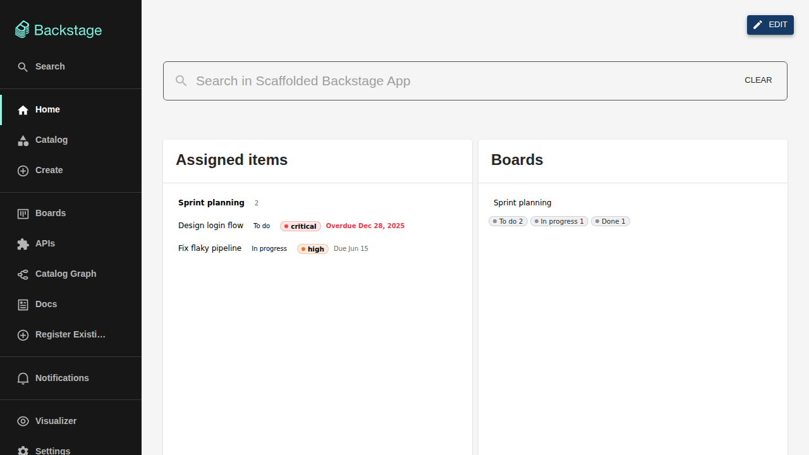

# Home page cards

The boards plugin contributes two widgets to the Backstage home page. In
this app's default layout they sit side by side under the search bar; the
page's **Edit** mode lets every user rearrange, resize, add, or remove
cards.

## Assigned items

Your due work at a glance: the card lists items assigned to you, with their
status, priority, and due date. Two settings on the placed card control
what it shows:

- **Scope** — all of your assigned items, or only due ones (overdue and due
  today).
- **Grouping** — group the listed items, for example per board.

Clicking an item takes you to its board; the card links to
[My items](my-items.md) for the full list.

## Boards

Your entry point to the boards you care about:

- **Scope** — your favorite boards (default) or all boards you can access.
  Favorites are per-user, so the same card shows different boards to
  different users.
- **Item counts** — optionally show per-board item counts.

## Behaviour

Both cards have defined loading, empty, and failure states — an empty card
tells you why it is empty, a failing one says so instead of spinning
forever. Cards left open refresh when a board change is signalled, so they
do not go stale.
