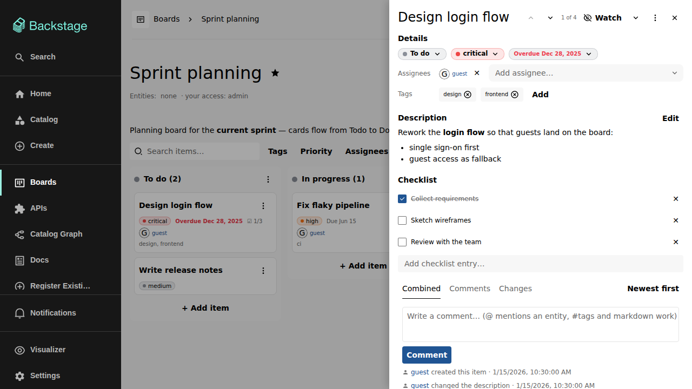

# The item details drawer

Clicking an item's title — on a card, a table row, or in My items — opens
the details drawer in place, on top of the view you came from.

The drawer is structured into clearly separated sections: the item's fields,
the description, the checklist, and the activity timeline. The watch control
and the item menu sit in the drawer header.

## Status, priority, and due date badges

The three badges at the top are not just displays — for users with write
access each one doubles as its own editor:

- The **status badge** opens a picker listing the board's columns; choosing
  one moves the item.
- The **priority badge** opens a picker with the board's priorities plus a
  clear entry ("No priority" when unset).
- The **due date badge** opens a menu with Today, Tomorrow, This week, a
  full **pick a date** input, and — when a date is set — a remove entry.

All three open on click and on right-click, are keyboard-focusable and
operable, and carry a visible dropdown affordance. Read-only users and
externally managed items get plain, non-interactive badges instead.

Due dates are colored by urgency everywhere they appear: overdue dates are
red and dated relative to today, upcoming ones cool down with distance.

## Assignees and tags

Assignees and tags render as a label/value table with their add controls in
the same row. Assignees are picked from the catalog (users and groups) and
shown with avatars and display names; free-text `text:` identities are
supported for people outside the catalog.

## Description

The description supports the same markdown subset as comments — including
headings and tables — and auto-links catalog entity refs and `@`-mentions.
Its heading row carries the edit and history controls: every save
creates a new version, and the history dialog lets you inspect earlier
versions. An in-progress edit survives closing the drawer or reloading the
browser — see [Comments and history](comments-and-history.md).

## Checklist

An item can carry a simple checklist: ordered, plain-text entries ticked off
directly in the drawer. Add entries with the input at the bottom, remove
them with the × on each row. On the kanban card the checklist is summarized
as a done-count badge (for example `1/3`), styled differently once complete.
Checklist changes are recorded in the item's history, and checklists survive
board duplication.

## Activity

The bottom of the drawer is the activity block with three tabs: **Combined**
(the unified timeline), **Comments**, and **Changes**, switchable between
newest-first and oldest-first. See
[Comments and history](comments-and-history.md) for the details.
