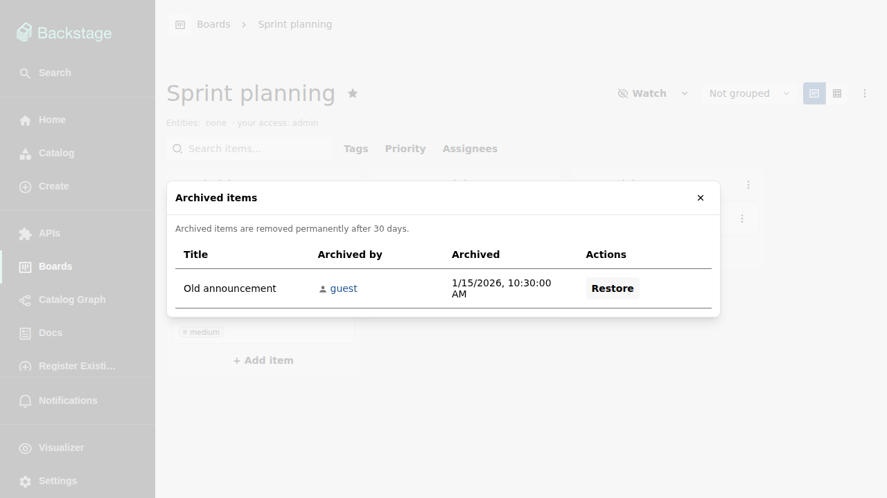

# Working with items

Items are the cards on a board. An item always belongs to exactly one board
and sits in one of its columns — that column is the item's status.

## Item fields

- **Title** (required).
- **Description** — rich text with version history (see
  [The item details drawer](item-details.md)).
- **Tags** — a flat list of labels, offered as filters once used.
- **Assignees** — one or more users or groups, picked from the catalog, or
  free-text identities (e.g. an external contractor) using the `text:`
  prefix.
- **Due date**, **priority**, and **checklist** — all optional; see the
  details drawer and [Priorities](priorities.md).

Wherever the UI names an assignee or creator, it shows the catalog entity's
display name and keeps the full entity ref reachable as a tooltip.

## Creating items

**+ Add item** in a kanban column creates an item in that column. The create
dialog can stay open after saving ("add another"), so several items can be
entered in a row.

## The item menu

Every card and table row carries an item menu — it also opens at the pointer
on right-click. It offers opening the details, moving the item to another
column, changing the assignee (with a catalog-backed submenu), quick
due-date choices (Today, Tomorrow, This week, a date picker, and remove),
priority (when the board defines priorities), watching the item, and
deleting it.

## Bulk actions

In the table view, select several rows with the checkboxes and change the
assignee or the priority of all selected items at once. Each bulk change is
recorded in every affected item's history like any other edit.

## Deleting and restoring items

Deleting an item archives it: it disappears from the board, table, and
filter views but keeps its fields, comments, and history. The board menu's
**Archived items** dialog lists them with who archived them and when, and
lets anyone with write access restore them:

Archival and restore both show up in the item's history. Items archived more
than 30 days ago are permanently removed by a scheduled backend task.

## Externally managed items

Items created by an integration (for example a future GitHub or Jira sync)
carry an "externally managed" marker. They are read-only for regular users:
edit, move, and delete controls are disabled or hidden, and only the owning
integration can change them.
