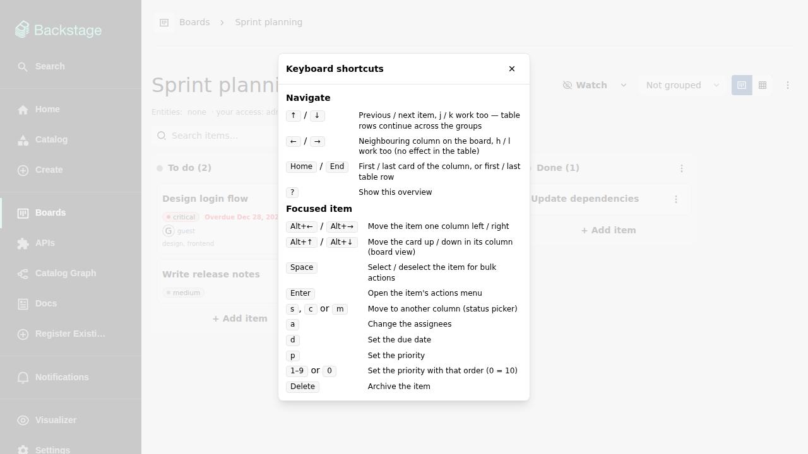

# Keyboard shortcuts

The board page — the kanban view and the table view alike — is fully
keyboard-operable. Press `?` anywhere on a board to open this reference
inside the app:

The dialog only lists what applies: on a board without priorities the
priority keys are left out, and read-only visitors see the navigation
shortcuts only. `Escape` (or the close button) dismisses it.

## Moving the focus

The cards of the kanban view form a single tab stop: tabbing into the
board focuses one card, marked with a visible focus ring, and the arrow
keys take it from there. In the table view the whole row takes the
focus.

| Key            | Kanban view                                                | Table view                                    |
| -------------- | ---------------------------------------------------------- | --------------------------------------------- |
| `↑` / `↓`      | Previous / next card in the column, through group sections | Previous / next row, continuing across groups |
| `←` / `→`      | Neighbouring column (empty columns are skipped)            | —                                             |
| `j` / `k`      | Same as `↓` / `↑`                                          | Same as `↓` / `↑`                             |
| `h` / `l`      | Same as `←` / `→`                                          | —                                             |
| `Home` / `End` | First / last card of the column                            | First / last row across all groups            |

At the edges the focus stays put. After a move or an archive the focus
follows the item, or falls to a neighbouring one.

## Acting on the focused item

While a card or row is focused — where a row lists several keys, each
one triggers the action on its own (`s`, `c` or `m` are three ways to
open the same picker, never a combination):

| Key               | Action                                            |
| ----------------- | ------------------------------------------------- |
| `Alt+←` / `Alt+→` | Move the item one column left / right             |
| `Alt+↑` / `Alt+↓` | Move the card up / down in its column (board)     |
| `Space`           | Select or deselect the item for bulk actions      |
| `Enter`           | Open the item's actions menu                      |
| `s`, `c` or `m`   | Open the move-to-column (status) picker           |
| `a`               | Open the assignee picker                          |
| `d`               | Open the due-date picker                          |
| `p`               | Open the priority picker (boards with priorities) |
| `1`–`9` or `0`    | Set the priority with that order (`0` = 10)       |
| `Delete`          | Archive the item                                  |
| `?`               | Open the shortcut overview                        |

`Alt+←`/`Alt+→` and the status picker respect
[hard WIP limits](board.md#wip-limits): a full column is skipped
respectively disabled, exactly like a drag onto it. The pickers are the
same menus the item's three-dot button opens — arrow keys, `Enter`, and
`Escape` work inside them, and closing one returns the focus to the
item.

## When shortcuts stay out of the way

The shortcuts fire only while the item itself has the focus. Typing in
an inline editor, the search field, or any text input is never
hijacked, and neither are open menus, dialogs, or the item details
drawer. On externally managed items and for read-only visitors the
mutating shortcuts are inert — navigation and `Enter` keep working.

Moving an item with the keyboard behaves like any other move: the view
updates optimistically, the change lands in the item's history, and a
rejected move rolls back.
