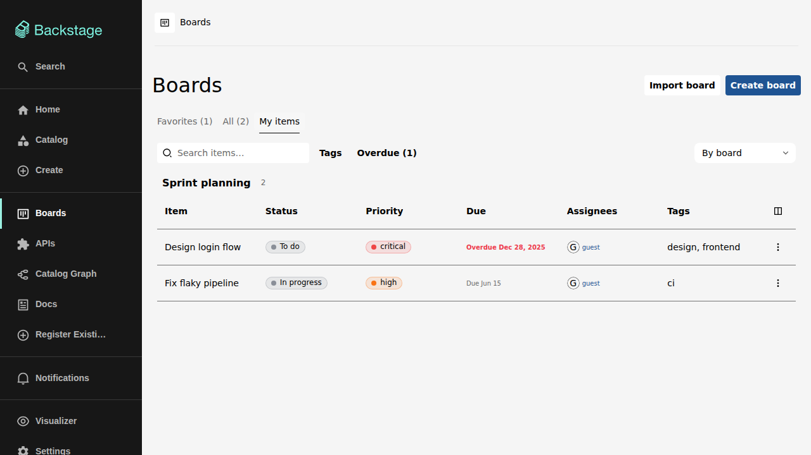

# My items

The **My items** tab on the boards list page (`/boards/my-items`) collects
everything assigned to you — directly or via one of your groups — across all
boards you can access.

## Filtering

My items has its own filter bar: free-text search over titles and
descriptions, a tag filter over the tags in use on the listed items, and an
assignee filter (useful when your groups bring in items shared with several
people). The same rules as on a board apply: all selected tags must match,
any selected assignee.

## Grouping

The grouping dropdown arranges the list:

- **By board** (default) — one section per board, with the board's name as
  the heading.
- **By due date** — the most overdue first, then upcoming dates, undated
  items last.
- **By tags** — one section per tag; an item carrying several tags appears
  in each of them.

## Working with items

Each row offers the same item menu as on the board itself — open the
details drawer in place, move, assign, set due dates and priorities, watch,
or delete — so routine updates never require leaving the page. Clicking an
item opens the [details drawer](item-details.md) right there.

Your assigned items are also available on the Backstage home page via the
[Assigned items card](home-page.md).
