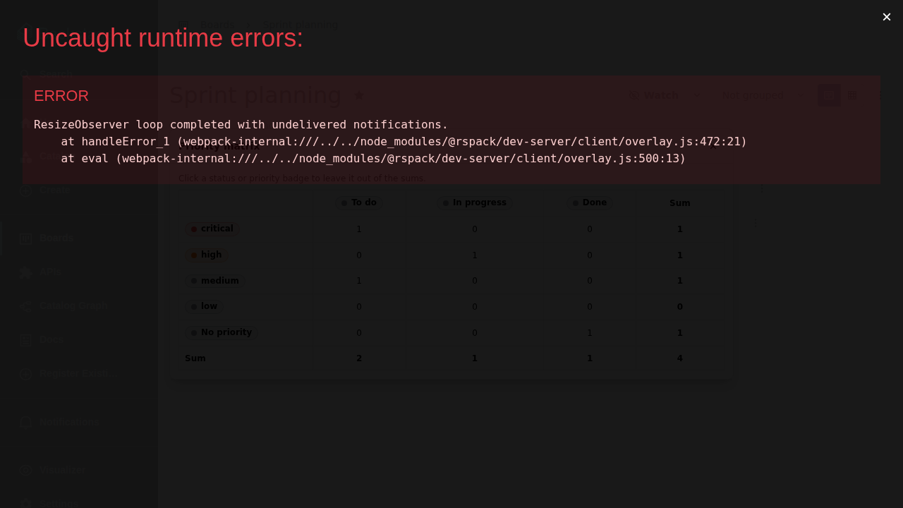

# Priorities

Each board can define its own ordered set of priorities that items
optionally carry. A board without priorities is perfectly valid — in that
case no priority UI (filter, grouping, table column, matrix, or item
editors) is shown anywhere.

## Defining priorities

Users with `admin` access manage the list in the board settings: create,
rename, recolor, rearrange, and delete, up to ten priorities, highest first.
Items reference priorities by id, so renaming one is always safe. New boards
start with a sensible default set.

Deleting a priority no item uses simply removes it. Deleting one that items
still use asks you to choose: reassign the affected items to another of the
board's priorities, or drop it and leave them with no priority — either way
no item (archived ones included) is left referencing a deleted priority.

## Where priorities appear

Once defined, priorities show up on every relevant surface:

- as a colored badge on kanban cards and in the table's Priority column,
- as a **Priority** filter in the filter bar,
- as a **By priority** grouping of the kanban view, highest first,
- in the [item details drawer](item-details.md) and the item menu as a
  combined display-and-editor badge,
- in the [Assigned items home page card](home-page.md),
- as a bulk action on selected table rows.

## The priority matrix

On boards that define priorities, the board menu offers a **Priority
matrix**: the board's statuses as columns and its priorities as rows (plus a
**No priority** row when unprioritized items exist), each cell counting the
matching non-archived items, respecting the active filters.

The status and priority badges in the headers are clickable toggles:
unselected ones are left out of the sum row, sum column, and overall total
while their own cell counts stay visible. Everything starts selected and
every toggle is reversible.

## Duplication

Duplicating a board always copies its priority definitions, and copied items
keep their priorities — see [The boards list](boards.md).
