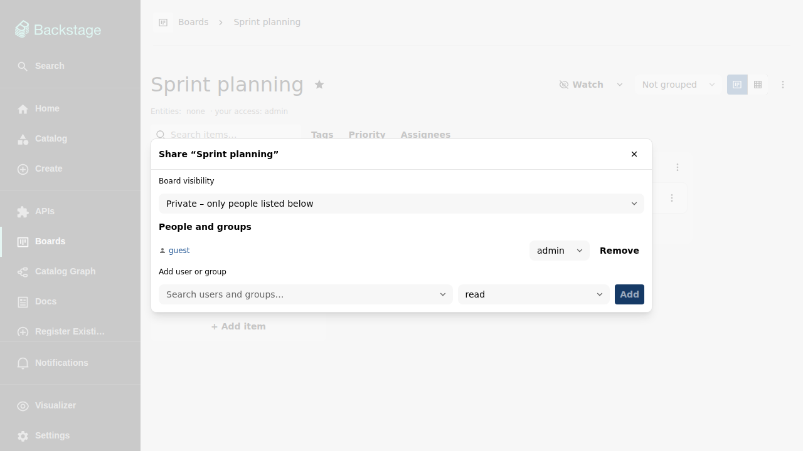

# Sharing a board

New boards are private. The board menu's **Share** dialog controls who can
see and change a board — all of it enforced server-side, on every API call,
not just in the UI.

## Permission levels

Grants are per user or per catalog group, at one of three levels:

| Level   | Allows                                                                           |
| ------- | -------------------------------------------------------------------------------- |
| `read`  | View the board, its items, comments, and history.                                |
| `write` | Everything in `read`, plus add/edit/move/delete items, comment, manage columns.  |
| `admin` | Everything in `write`, plus settings, sharing, renaming, and deleting the board. |

Your effective level is the **highest** of: your direct grant, any grant of
a group you belong to (via the catalog's `memberOf` relations), and the
board's public mode.

## Public modes

Besides individual grants, the whole board has a visibility mode:

- **Private** — only the people and groups listed below.
- **Logged-in read / logged-in write** — every signed-in user can read
  (or write).
- **Public read / public write** — everyone, even without signing in.

## Picking people and groups

The share dialog's picker searches the catalog's users and groups, so grants
always target real catalog identities and are shown with their display
names.

## Odds and ends

- Duplicating a shared board makes **you** the admin of the copy; the
  original's grants are only copied when you tick "Copy share settings"
  (see [The boards list](boards.md)).
- Archived boards are read-only for everyone; unarchiving and immediate
  deletion require `admin`.
- The board header always shows your own access level, so you know why an
  action is or is not offered.
