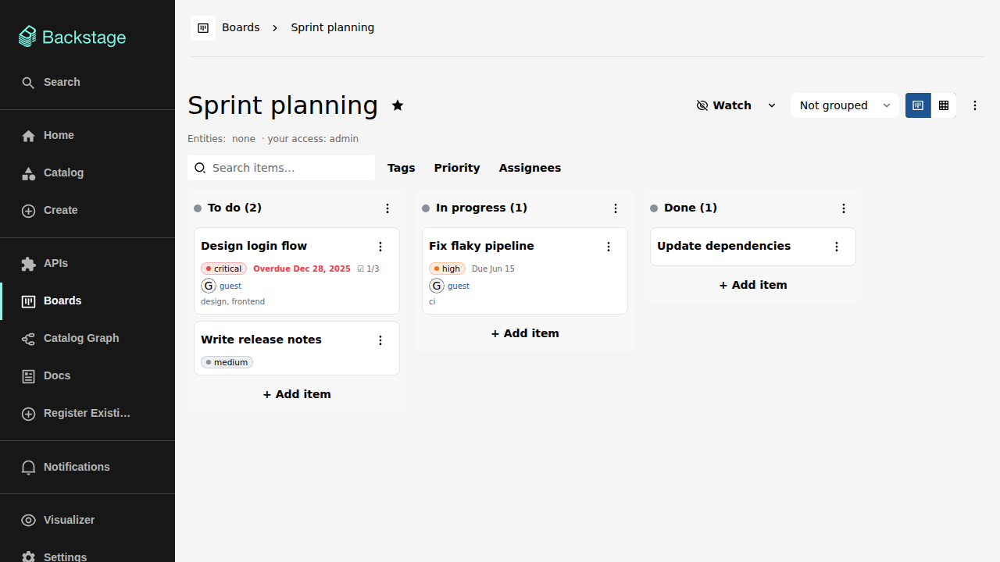

# Backstage Boards

Boards brings shareable kanban boards into the Backstage developer portal.
Boards live next to your catalog: they can reference catalog entities, assign
work to catalog users and groups, and send updates through the Backstage
notifications system.

## What you can do with it

- Organize work as **items on boards**, in a kanban view or a table view.
- **Share** each board with exactly the people and groups that need it, from
  fully private to fully public.
- Track **due dates, priorities, checklists, tags, and assignees** on every
  item.
- Discuss items in **comments** and follow every change in a full
  **history timeline**.
- **Watch** boards or single items and get Backstage notifications when they
  change.
- Pin your work to the **Home page** and find everything assigned to you
  under **My items**.

## Where to go next

- **[Installation](installation.md)** — for admins: run this app or add the
  plugins to an existing Backstage instance.
- **[Configuration](configuration.md)** — for admins: database, reminders,
  entity tab, and home page options.
- **Features** — for users: a page per feature area, starting with
  [the boards list](features/boards.md).

Boards is developed spec-first: the behaviour of every feature described in
these pages is specified in `openspec/specs/boards/` in the repository.
